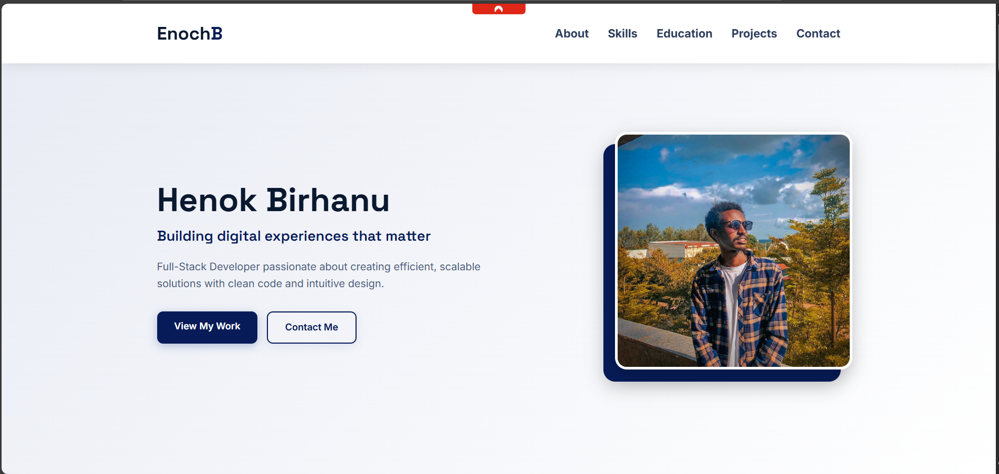

# Henok Birhanu - Professional Portfolio

 <!-- Add a screenshot later -->

A modern, responsive portfolio website built with pure HTML and CSS showcasing my skills, projects, and professional background.

## Features

✨ **Fully Responsive Design** - Works flawlessly on all devices  
🎨 **Dark Blue Theme** - Professional color scheme with enhanced shadows  
🚀 **CSS-Only Interactions** - No JavaScript required  
📱 **Mobile-Friendly Navigation** - Hamburger menu with smooth animations  
📝 **Complete Sections**:
- Hero with call-to-action
- About me with personal values
- Skills showcase
- Education timeline
- Project gallery
- Interests
- Contact form
- Footer with social links

## Technologies Used

- **HTML5** - Semantic markup
- **CSS3** - Flexbox, Grid, Variables, Animations
- **Google Fonts** - Inter & Space Grotesk typography

## Design Highlights

- **Modern Card Design** with hover effects
- **CSS Variables** for easy theming
- **Box Shadow Effects** for depth
- **Smooth Scrolling** navigation
- **Accessible** color contrast
- **Optimized** for performance

## How to Use

1. Clone the repository:
   ```bash
   git clone https://github.com/enoch-B/portfolio.git

## If you want viste live
 [https://enoch-b.github.io/portfolio/]
